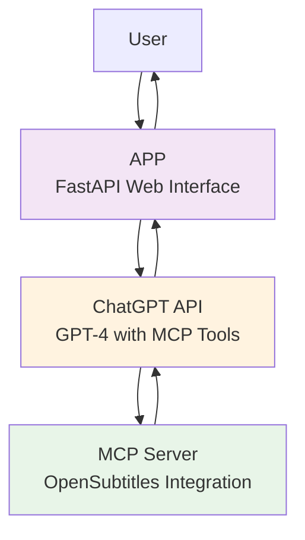

# CineChunks

Transform any movie into an episodic series! CineChunks uses AI and real subtitle data to intelligently split movies into episodes with natural story boundaries, perfect for planning your viewing sessions.

## 🏗️ Architecture



The project consists of two main components:

### 1. MCP OpenSubtitles Server (`mcp-opensubtitles/`)
- **Purpose**: Provides MCP (Model Context Protocol) tools for movie data
- **Tools**:
  - `verify_movie`: Checks if a movie exists in OpenSubtitles database
  - `download_subtitles`: Downloads actual subtitle files for movies
- **Technology**: FastMCP, httpx, OpenSubtitles API

### 2. Web Application (`cinechunks-web/`)
- **Purpose**: User interface and AI processing
- **Features**:
  - Clean, modern web interface
  - Form to input movie title and episode preferences
  - AI-powered episode generation using OpenAI
  - Real-time loading states
  - Responsive design
- **Technology**: FastAPI, Jinja2, OpenAI API

## 🚀 Quick Start

### Prerequisites
- Python 3.8+
- OpenAI API key
- OpenSubtitles API key

### 1. Clone the Repository
```bash
git clone <repository-url>
cd CineChunks
```

### 2. Set Up Environment Variables
Create a `.env` file in the project root:

```bash
# OpenAI Configuration
OPENAI_API_KEY=your_openai_api_key_here
OPENAI_MODEL=gpt-4o-mini

# OpenSubtitles Configuration
OPEN_SUBTITLES_API_KEY=your_opensubtitles_api_key_here
OPEN_SUBTITLES_USERNAME=your_username_optional
OPEN_SUBTITLES_PASSWORD=your_password_optional

# MCP Server Configuration
MCP_HTTP_HOST=127.0.0.1
MCP_HTTP_PORT=8000
MCP_HTTP_PATH=/mcp
```

### 3. Start the MCP Server
```bash
cd mcp-opensubtitles
python3 -m venv .venv
source .venv/bin/activate 
pip install -r requirements.txt
python server.py
```

The MCP server will start on `http://127.0.0.1:8000/mcp`

### 4. Start the Web Application
```bash
cd cinechunks-web
python3 -m venv .venv
source .venv/bin/activate 
pip install -r requirements.txt
uvicorn app:app --reload
```

The web application will start on `http://127.0.0.1:8000`

### 5. Open in Browser
Navigate to `http://127.0.0.1:8000` and start creating your movie episodes!

## 📋 How to Use

1. **Enter Movie Title**: Type the name of any movie
2. **Choose Episode Style**:
   - **By Number**: Specify how many episodes you want (e.g., 8 episodes)
   - **By Length**: Specify episode duration (e.g., 45 minutes each)
3. **Submit**: Click submit and wait for the AI to process
4. **View Results**: Get your episode breakdown with timestamps and synopses

## 🔧 Configuration

### OpenAI Settings
- **Model**: Default is `gpt-4o-mini` (cost-effective)
- **API Key**: Required for AI processing
- **Response Format**: Enforced JSON output for consistent results

### OpenSubtitles Settings
- **API Key**: Required for subtitle access
- **Username/Password**: Optional, for higher rate limits
- **Language**: Default is English (`en`)

### MCP Server Settings
- **Host**: Default `127.0.0.1` (localhost)
- **Port**: Default `8000`
- **Path**: Default `/mcp`

## 📄 License

This project is open source. Please check the license file for details.